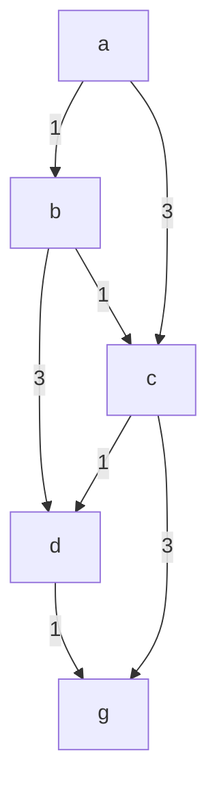
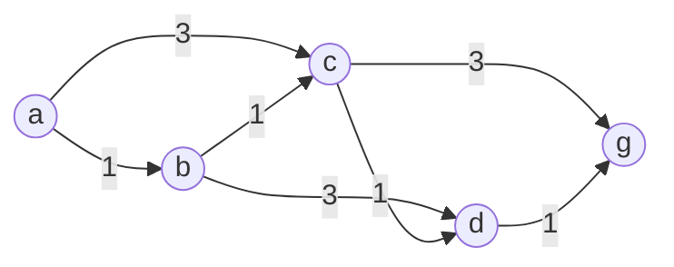

```mermaid
graph TD
    A[a] -->|1| B[b]
    A -->|3| C[c]
    B -->|3| D[d]
    B -->|1| C
    C -->|1| D
    C -->|3| G[g]
    D -->|1| G
```

```mermaid
graph LR
    A((a))--1-->B((b))
    A((a))--3-->C((c))
    B((b))--1-->C((c))
    B((b))--3-->D((d))
    C((c))--1-->D((d))
    C((c))--3-->G((g))
    D((d))--1-->G((g))
```